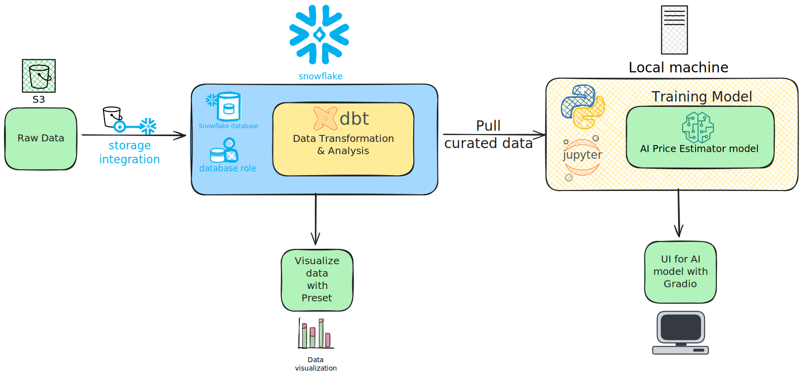

# Airbnb Berlin Price Estimator AI Models

This project is an end-to-end data engineering and machine learning pipeline that automates the transition from raw data storage to a functional AI model.


## Table of contents

* [Introduction](#introduction)
* [Installation](#installation)
* [Quick start](#quick-start)
* [Usage](#usage)


## Introduction
This project was originally meant to an **end-to-end ELT pipeline** using modern teck stack. After finish the pipeline, I wanted to use the curated data to solve a real-life problem which leads to the next part of my project: Building an **AI Price Estimator**. This model will suggest optimal prices for host who wants to rent their apartement/house on Airbnb, specifically in Berlin region to avoid overprice/underprice and market inflation.


Quick summary of the project:
- **ELT Pipeline**:
    + **Extraction:** Ingesting raw datasets from **AWS S3**.
    + **Warehouse & Transform**: Leveraging **Snowflake** for storage and **dbt** for modular data modeling and analysis.
    + **Analytics**: Visualizing market trends using **Preset**
- **Machine Learning & Deployment**:
    + **Data Science**: Performing EDA and feature engineering using **Python (Pandas, Scikit-learn)**.
    + **Modeling**: Comparing performance across **Linear Regression**, **Random Forest** and **Gradient Boosting algorithms**.
    + **Interface**: Deploying a functional UI with **Gradio**


## Installation
For this project, you should have your own **Snowflake** and **Preset** account. For the **Snowflake** account, you can keep recreating new ones **using the same email** to get infinite credits *(it could be patched by the time you read this)*. 
Keep in mind that if you using new Snowflake account, you have to do the whole database/role setup again.

You should also create a virtual environment for this project either by **uv**, **conda** or just regular env library by Python:

```sh
uv pip install
```

## Quick start
Pull the repo to your local machine:

```sh
git pull https://github.com/VuAnh183/Airbnb-Berlin-Price-Estimator-AI-Models
```

Next, install all the required Python libraries using this command:

```sh
pip install -r requirements.txt
```

## Usage

##### *Updating...*